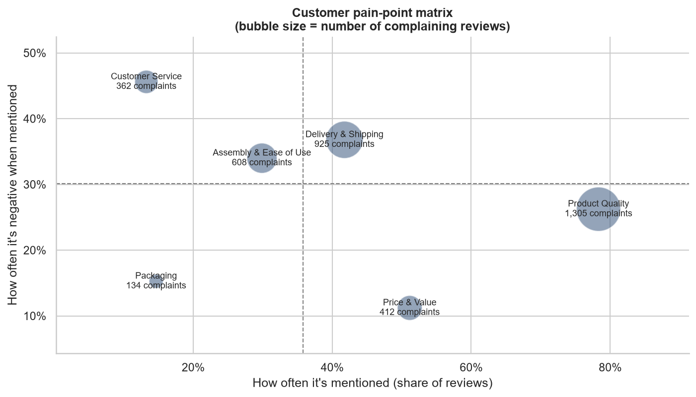
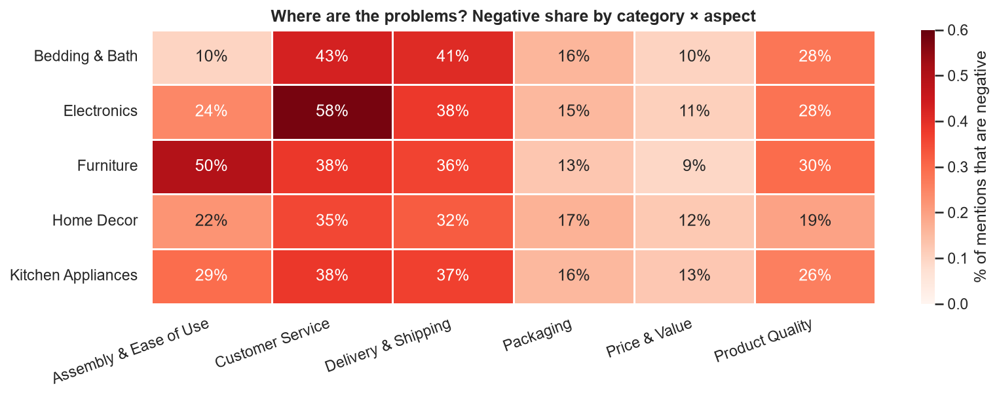
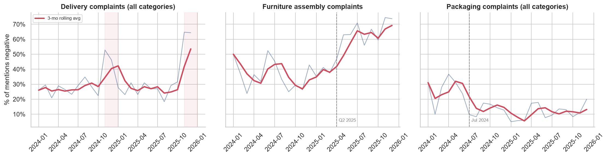
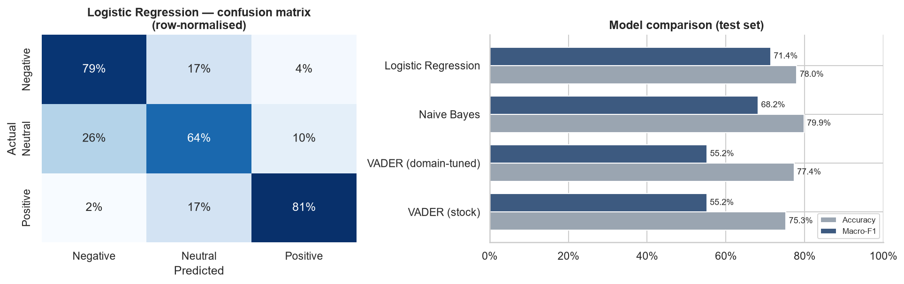

# 🛋️ Customer Review Sentiment Analysis: Turning 6,000 Reviews into Operational Fixes


> **Applied NLP to 6,000 e-commerce reviews to find *what* customers are unhappy about and
> *which team owns the fix*.** The analysis surfaced a worsening holiday delivery problem,
> a supplier-driven furniture assembly issue and an Electronics support backlog. It also
> showed that off-the-shelf sentiment tools would have hidden two of these.

📓 **[View the full notebook →](notebooks/sentiment_analysis.ipynb)**

---

## 📌 Business problem

UrbanNest, a fictional online home and electronics retailer, collects thousands of product
reviews. Leadership can see star ratings slipping in some categories but cannot see *why*,
and nobody has time to read every review. Stakeholders asked:

1. How do customers feel overall, and which categories under-perform?
2. Can sentiment be classified automatically and reliably enough for weekly monitoring?
3. **What specifically** drives dissatisfaction (product, delivery, price, service, packaging or assembly), and who owns each fix?
4. Are these problems getting better or worse?

## 🧭 Approach

```
Raw reviews ─► Cleaning & QA ─► EDA ─► Lexicon sentiment (VADER, domain-tuned)
                                     ─► ML classifier (TF-IDF + Logistic Regression)
                                     ─► Aspect-based sentiment ─► Trend analysis ─► Recommendations
```

| Step | What I did | Why it matters |
|------|-----------|----------------|
| **Data cleaning** | Removed 25 duplicate submissions and 18 empty reviews; imputed 30 missing regions | Trustworthy counts |
| **Lexicon sentiment** | Scored every review with VADER, then **extended its lexicon with about 40 retail terms** (`overpriced`, `flimsy`, `never responded`, `stopped working`) | Stock VADER missed most service and price complaints |
| **ML classifier** | TF-IDF (unigrams and bigrams, negation-aware stop words) with Logistic Regression, compared against Naive Bayes and VADER | A model trained on our own reviews learns domain language |
| **Aspect-based sentiment** | Split reviews into sentences, tagged each with a business aspect and scored it | One review can praise quality *and* criticise delivery |
| **Trend analysis** | Tracked monthly negative share per aspect | Shows whether problems are growing or have been fixed |

## 📊 Key results

### 1. Where customers are unhappy


### 2. Which category–aspect combinations need attention


### 3. How the problems change over time


### 4. Model performance


| Model | Accuracy | Macro-F1 |
|-------|---------:|---------:|
| VADER (stock) | 75.3% | 55.2% |
| VADER (domain-tuned) | 77.4% | 55.2% |
| Naive Bayes | 79.9% | 68.2% |
| **Logistic Regression** ✅ | **78.0%** | **71.4%** |

Naive Bayes has slightly higher accuracy but leans towards the majority Positive class. **Macro-F1**
weights Negative and Neutral reviews equally with Positive ones. Those are the reviews the business
most needs to catch, so Logistic Regression was selected.

## 💡 Insights and recommendations

| # | Finding | Recommendation | Owner |
|---|---------|----------------|-------|
| 1 | **Holiday delivery failures are worsening.** Negative delivery mentions rise from ~27% to **49% (Nov–Dec 2024)** and **65% (Nov–Dec 2025)**. | Add peak-season carrier capacity from October, set more conservative delivery estimates, and send proactive delay notifications. | Logistics |
| 2 | **Furniture assembly complaints nearly doubled from Q2 2025** (37% → 65% negative): misaligned holes, missing screws. | Audit Q2 2025 suppliers, add a hardware checklist at packing, and publish video assembly guides. | Supplier QA |
| 3 | **Electronics has a support problem.** 58% of its service mentions are negative, against 35–43% elsewhere. | Set up a dedicated Electronics support queue with a 24-hour SLA and track first-contact resolution. | Customer Service |
| 4 | **Product quality drives most negative reviews.** 70% of 1–2★ reviews contain a negative quality sentence. | Flag products above their category's negative-quality baseline for vendor review each month. | Category Mgmt |
| 5 | **The July 2024 packaging redesign worked.** Negative packaging mentions fell from 27% to 12%. | Use the same before/after measurement for future operational changes. | Operations |
| 6 | **Price is not the problem.** Only 11% of price mentions are negative. | Avoid discounting in response to falling ratings. Fix fulfilment and quality first. | Pricing |

**Methodology lesson:** stock VADER labelled fewer than 1 in 10 customer-service mentions as negative.
After domain tuning, the figure is about 46%. Validating an off-the-shelf model against real business
language changed the conclusion.

## 🗂️ Repository structure

```
customer-review-sentiment-analysis/
├── data/
│   ├── raw/reviews.csv                 # 6,025 raw reviews (with deliberate data-quality issues)
│   └── processed/                      # scored reviews and aspect-level mentions (BI-ready)
├── images/                             # charts used in this README
├── notebooks/
│   ├── sentiment_analysis.ipynb        # ⭐ full analysis with outputs
│   └── sentiment_analysis.py           # same notebook in plain-text (jupytext) format for clean diffs
├── src/
│   ├── generate_reviews.py             # reproducible dataset generator
│   ├── domain_vader.py                 # VADER with a retail-specific lexicon
│   └── aspects.py                      # sentence splitting and aspect tagging
└── requirements.txt
```

## ▶️ How to run

```bash
git clone https://github.com/jpuppala1707/customer-review-sentiment-analysis.git
cd customer-review-sentiment-analysis
pip install -r requirements.txt
python src/generate_reviews.py          # optional: regenerate the dataset
jupyter notebook notebooks/sentiment_analysis.ipynb
```

## 📝 About the data

The dataset is **synthetic**. It was generated by [`src/generate_reviews.py`](src/generate_reviews.py) to
mimic real e-commerce reviews: realistic rating skew, seasonality, mixed-sentiment reviews,
negation and sarcasm, star ratings that don't always match the text, and data-quality issues.
Several business problems were planted in the data **without being passed to the
analysis**, which tests whether the pipeline can uncover them on its own. Because the reviews come
from phrase templates, they are more regular than real text, so the model scores here are best
read as a *relative* comparison of methods.

The same pipeline can be applied to a real dataset such as the
[Amazon Reviews 2023](https://amazon-reviews-2023.github.io/) corpus by changing the input file
and column names.

## 🚀 Next steps
- Schedule weekly scoring and feed `data/processed/` into a Power BI dashboard with alerts when an aspect's negative share jumps.
- Replace keyword aspect tagging with a zero-shot transformer classifier once sentence-level labels exist.

---
**Jatin Kumar Puppala** · Data Analyst · [GitHub](https://github.com/jpuppala1707)
